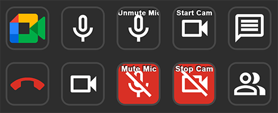

# Stream Deck Google Meet Plugin



This is a plugin that allows the [Elgato Stream Deck](https://www.elgato.com/en/gaming/stream-deck) to control your camera and microphone in a Google Meet call. It provides toggle buttons that show whether your camera and mic are on or off, and they update whenever you press a Stream Deck button or mute/unmute directly in Meet. It also provides dedicated on/off keys, in case you prefer single-purpose buttons.

This plugin works in conjuction with our Google Chrome web extension, which is required for this plugin to function.

Developed and tested primarily on macOS 10.15, Python 3.8.5, Chrome 84, and Stream Deck app v4.8.1. It should work on Windows as well.

## Installing

1. From the [Releases page](https://github.com/ChrisRegado/streamdeck-googlemeet/releases), download the `com.chrisregado.googlemeet.streamDeckPlugin` package and open it. The Stream Deck desktop software will prompt you to install the plugin.
2. The Chrome extension is not in the web store, so we'll install it manually from source. From the [Releases page](https://github.com/ChrisRegado/streamdeck-googlemeet/releases), download the source code zip and extract it somewhere you can keep it. (If you move the folder after installing, Chrome will remove the extension from your browser and you'll have to re-add it.)
3. From Chrome's Extension settings (`chrome://extensions/`), turn on "Developer mode" using the toggle in the top-right corner.
4. Click the "Load unpacked" button in the top-left corner, and select the `browser-extension` folder from the zip you extracted earlier.
5. You can turn Developer mode back off now if you want.
6. Add the buttons to your Stream Deck, and start a Google Meet call to try them out!

## Updating

To update the Stream Deck plugin, download and open the plugin package just like when you initially installed it. If you experience any glitches after updating (such as on/off icons not changing on the toggle buttons), please try deleting your Meet buttons and re-adding them to your Stream Deck in the Stream Deck desktop app.

To update the Chrome extension, uninstall your existing version by clicking Remove in the Chrome Extension Settings page, and then follow the installation instructions again to install the new version.

## How It Works

The Stream Deck plugin launches a localhost-only Websocket server on port 2394, which our browser extension connects to. The plugin and browser extension send messages back and forth over that websocket to notify the Stream Deck when Meet changes its device on/off status, and simulates Meet mute button clicks in your browser when you press a key on your Stream Deck.

The Stream Deck plugin code is in the `streamdeck-plugin` directory. The Chrome extension code is in the `browser-extension` directory. The `com.chrisregado.googlemeet.sdPlugin` directory becomes our Stream Deck plugin distributable once we bundle our code, and contains our Stream Deck assets.

## Developing the Stream Deck Plugin

### First Time Setup

The plugin is written in Python. Create a venv to hold your package's dependencies, and install those dependencies:

MacOS:

```
cd streamdeck-plugin
python3 -m venv venv/
source venv/bin/activate
pip install -r requirements.txt
```

Windows:

```
cd streamdeck-plugin
python3 -m venv venv/
venv\Scripts\activate.bat
pip install -r requirements.txt
```

Remember that virtualenvs are not portable. If you move this folder at all, you'll have to delete the venv and re-create it.

### Running Unit Tests

MacOS:

```
cd streamdeck-plugin
source venv/bin/activate
python -m unittest
```

Windows:

```
cd streamdeck-plugin
venv\Scripts\activate.bat
python -m unittest
```

### Bundling

We use `pyinstaller` to bundle our code, dependencies, and a Python runtime environment into an executable. We put that executable into the `com.chrisregado.googlemeet.sdPlugin` folder, which in turn gets zipped up by the [Elgato DistributionTool](https://developer.elgato.com/documentation/stream-deck/sdk/exporting-your-plugin/) as our final distributable plugin package. That plugin package ends up including any assets we need (e.g. icons), the `manifest.json` file that defines our plugin for the Stream Deck desktop app, and our executable plugin code. Double-click that plugin package and the Stream Deck software will prompt you to install it.

To build the bundle:

MacOS:

```
cd streamdeck-plugin
source venv/bin/activate
rm -rf ../com.chrisregado.googlemeet.sdPlugin/dist/macos
pyinstaller --clean --dist "../com.chrisregado.googlemeet.sdPlugin/dist/macos" src/main.py
rm -rf build
```

Windows:

```
cd streamdeck-plugin
venv\Scripts\activate.bat
rmdir /q /s "..\com.chrisregado.googlemeet.sdPlugin\dist\windows"
pyinstaller --clean --dist "..\com.chrisregado.googlemeet.sdPlugin\dist\windows" src\main.py
rmdir /q /s build
```

Note that the resulting executable is only valid for the OS you built it on. MacOS and Windows bundles must be created separately from a machine/VM of that OS, and then combined into the `com.chrisregado.googlemeet.sdPlugin/dist/` folder with `macos` and `windows` subdirectories for release.

If you're just testing locally (so you only care about one OS), you can place any file in the other OS's executable location (`CodePath`s from `manifest.json`) to appease the Elgato DistributionTool. Example:

```
mkdir -p com.chrisregado.googlemeet.sdPlugin/dist/windows/main
touch com.chrisregado.googlemeet.sdPlugin/dist/windows/main/main.exe
```

Or, if you don't ever plan on publishing your local builds, delete the other OS's CodePath and `OS` entry in manifest.json so you don't have to worry about multi-OS support.

Finally, use the DistributionTool to bundle everything into the Stream Deck plugin distributable that you can send to users:

```
./DistributionTool -b -i ./com.chrisregado.googlemeet.sdPlugin -o ~/Desktop/
```

## Developing the Chrome Extension

Follow the usual "Load unpacked" installation instructions described above, pointing Chrome at the `browser-extension` folder of your workspace. You can then reload the extension directly from source using the reload button on Chrome's Extension Settings page. See https://developer.chrome.com/extensions/getstarted for more details.

## Uninstalling

In the Stream Deck desktop app, click the "More Actions..." button, search for "Google Meet" (or scroll down to find it), and click the "Uninstall..." button.

In Chrome, go to your Extensions Settings page (`chrome://extensions/`), and click the Remove button for the Stream Deck Google Meet Actions.

## Contributing

Feel free to contribute a feature or bug fix by opening a pull request. If you discover any problems or have any suggestions, please open a GitHub Issue.

## Credits

This project was inspired by https://github.com/JeroenVdb/streamdeck-googlemeet.

Neither this app nor its creator are affiliated with or endorsed by Google. The Google Meet name and logo are the exclusive property of Google.
